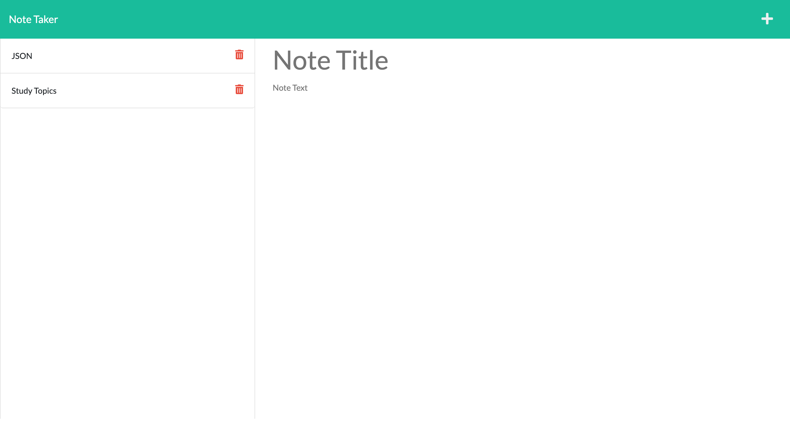

# Note Taker
  ### 

  ## Table of Contents:
  - [License](#license)
  - [Description](#description)
  - [Installation](#installation)
  - [Usage](#usage)
  - [Tests](#tests)
  - [Screenshot](#screenshot)
  - [Contributors](#contributors)
  - [Questions?](#questions)

  ## License
  None

  ## Description
  This application was created to allow the user to create, save, view, and delete notes in order to keep themselves organized. 

  ## Installation Instructions
  Clone the repo and open the Integrated Terminal in the root folder. Run 'npm i' to install dependencies then node server.js. Application can be viewed through localhost:3001 on Insomnia or the browser.

  ## Usage
  Click [here](https://rune-of-requirement.herokuapp.com/) to visit the deployed Heroku site

  To create a new note enter a title and body text into the appropriate sections then click the save icon. Clicking on the saved note titles will bring up the full note to view. Once the note is no longer needed, it can be deleted permanently by clicking the trash icon.

  ## Tests
  none

  ## Screenshot
  

  ## Contributors
 Please create a new branch to contribute to this project

  ## Questions? Reach me here:
  ### https://github.com/ddouglas86
  ### test@email.com
